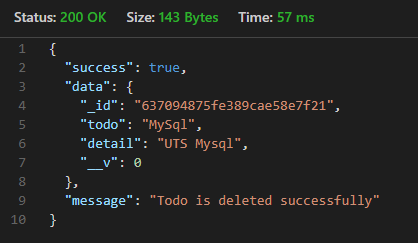

## Register

| Attributes | Tipe Data | Deskripsi                                |
| ---------- | --------- | ---------------------------------------- |
| username   | String    | Nama akun & untuk autentifikasi pengguna |
| password   | String    | Untuk autentifikasi pengguna             |
| email      | String    | Data diri pengguna                       |

**Request :**

- Method : Post
- Endpoint : auth/register
- Header :
  - Content-Type : Application/json
  - Accept : application/json
- Body :
  

**Response :**

---

## Login

| Attributes | Tipe Data | Deskripsi                                |
| ---------- | --------- | ---------------------------------------- |
| username   | String    | Nama akun & untuk autentifikasi pengguna |
| password   | String    | Untuk autentifikasi pengguna             |

**Request :**

- Method : Post
- Endpoint : auth/login
- Header :
  - Content-Type : Application/json
  - Accept : application/json
- Body :
  

**Response :**

---

## Todo

#### Create Todo

| Attributes | Tipe Data | Deskripsi       |
| ---------- | --------- | --------------- |
| todo       | String    | Judul todo      |
| detail     | String    | Penjelasan todo |

**Request :**

- Method : Post
- Endpoint : todo/createTodo
- Header :
  - Content-Type : Application/json
  - Accept : application/json
  - Authorization : bearer [jwt]
- Body :
  

**Response :**

---

#### Update Todo

**Request :**

- Method : Post
- Endpoint : todo/updateTodo?idTodo=637091365fe389cae58e7f1b
- Header :
  - Content-Type : Application/json
  - Accept : application/json
- Body :
  

**Response :**

---

#### Get Detail Todo

**Request :**

- Method : Get
- Endpoint : todo/getDetailTodo?idTodo=637094875fe389cae58e7f21
- Header :
  - Content-Type : Application/json
  - Accept : application/json
  - Authorization : bearer [jwt]

**Response :**

---

#### Get All Todo

**Request :**

- Method : Get
- Endpoint : todo/getAllTodo
- Header :
  - Content-Type : Application/json
  - Accept : application/json
  - Authorization : bearer [jwt]

**Response :**

---

#### Delete Todo

**Request :**

- Method : Delete
- Endpoint : todo/deleteTodo?idTodo=637094875fe389cae58e7f21
- Header :
  - Content-Type : Application/json
  - Accept : application/json
  - Authorization : bearer [jwt]

**Response :**

---

#### Delete All Todo

**Request :**

- Method : Delete
- Endpoint : todo/deleteAllTodo
- Header :
  - Content-Type : Application/json
  - Accept : application/json
  - Authorization : bearer [jwt]

**Response :**

